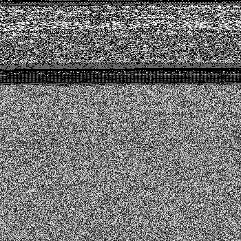
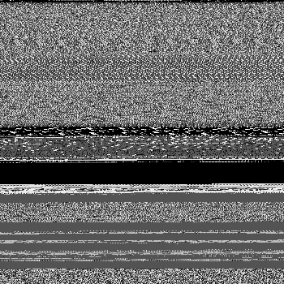
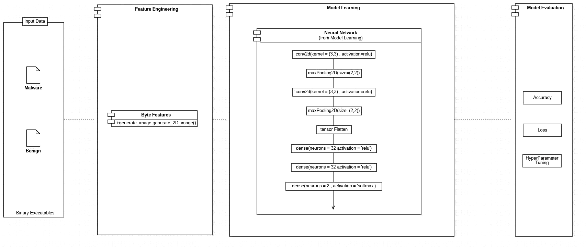
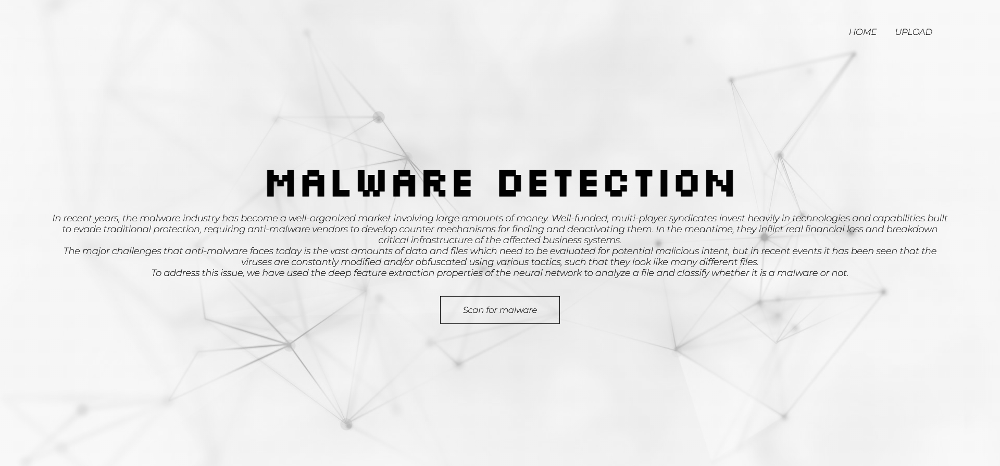
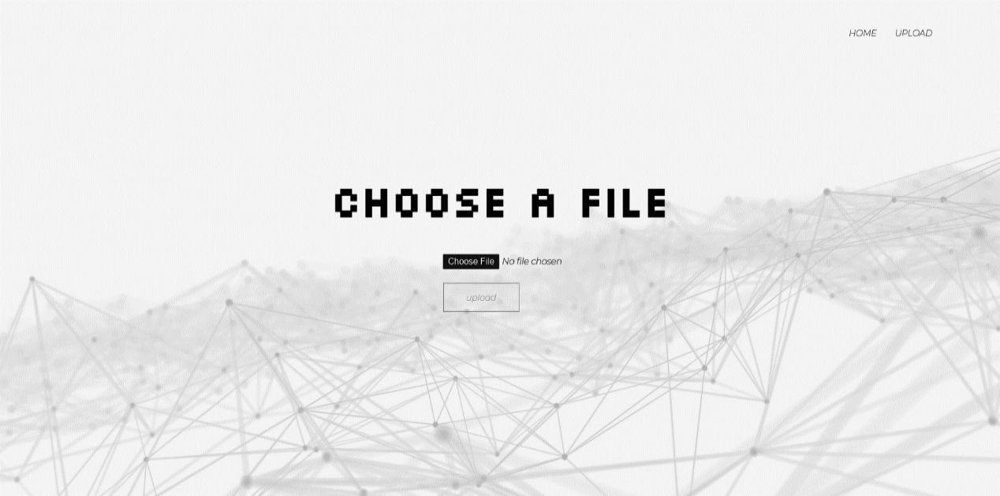
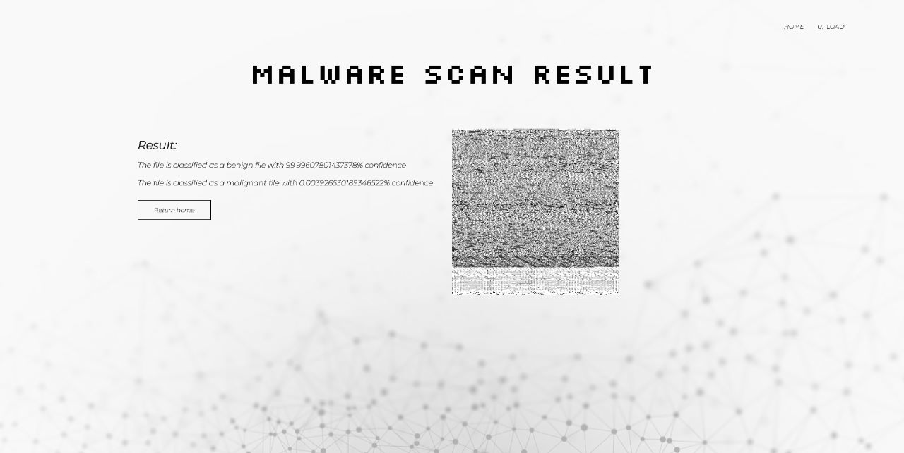
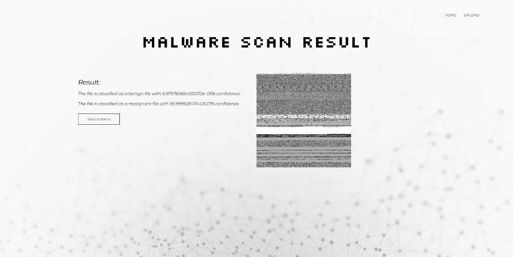

# Malware Detection using Deep Learning

| Contents |
| --- |
| [Introduction](#introduction) |
| [Motivation](#motivation) |
| [Dataset](#dataset) |
| [Model Overview](#model-overview) |
| [How it works](#how-it-works) |
| [Web App](#web-app) |

## Introduction

Detection of malware in a file by using the visual properties in the malware files and their families by using the Vision-Based analysis for identification of malware in the files.

Vision-Based analysis employs converting the binary file to a vector and then passed down for further analysis. We employed the use of CNN for detection of malware and their respective families in the files based from the images generated for the given files.

## Motivation

The major challenges that anti-malware faces today is the vast amounts of data and files which need to be evaluated for potential malicious intent, but in recent events it has been seen that the viruses are constantly modified and/or obfuscated using various tactics, such that they look like many different files.

To address this issue, we have leveraged the deep feature extraction properties of neural networks to analyze a file and classify whether it is a malware or not.

## Dataset

7z Archive of malwares and Benign files were downloaded from [practicalsecurityanalytics.com](https://practicalsecurityanalytics.com/pe-malware-machine-learning-dataset/) that contains malware files and benign files of 117GB.

| File details | metric |
| ---: | :--- |
| Samples | 201,549 |
| Benign | 86,812 |
| Malicious | 114,737 |
| Compressed Size | 43.8GB |
| Uncompressed Size | 117GB |

## Model Overview

The proposed model consists of two phases, analysis, and classification phase. In the analysis phase, each binary file is transformed into a 2D array and visualized as a grayscale image. The second phase involves the classification of malware into their corresponding classes based on the image patterns.

The model contains two CNN layers
> Conv2D(32 , (3,3) , activation='relu' , input_shape=(x_train.shape[1],x_train.shape[2],1))
>
> Conv2D(32 , (3,3) , activation='relu')

Followed by a max pooling layer

> MaxPooling2D((2,2))

And followed by a flatten,

> Flatten()

The result is 1x307328 convoluted version of the original grayscale image.

Then it is passed to a Fully connected Neural Network

>Dense(32 , activation='relu')
>
>Dense(32 , activation='relu')

Then a final dense layer with 'softmax' activation function

>Dense(2 , activation='softmax')

for classifying image to benign or malware.

This model has shown **88.64%** accuracy over test samples.

## How it works

### Overview - TL;DR

File -> Image(350x350) -> CNN -> Classification

Builds an image from the binary file such as the information is mapped one to one such as `8 bits => 1 byte => 1 pixel` in the image.

### Example images

| Benign file | Malware file |
| :---: | :---: |
|  |  |

The generated images are then sent to CNN model and then a softmax layer for classificaiton.

### Process Architecture

The process involved for the training of the model



## Web App

A web app is included for utilizing the model for classification of any given file

Run this from the project root

```bash
$python ./app/app_with_model.py
```

Visit `http://localhost:5000` to utilize the app

Below screenshots of the app's UI is greyscaled and inverted for better visibility in the documentation

Homepage


Upload Page


Result Page for a Benign File


Result Page for a Malware File

